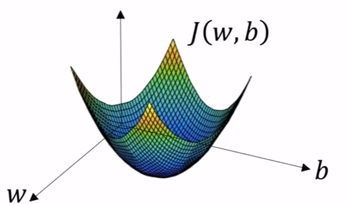

# Binary Classification
For example: identify a cat (1 cat, 0 non cat)  
Input: Red, Green, Blue  
feature vector: a vector with a size of $64*64*3$  
$n_{x}$ = n = 12288  
using x to predict y  

## notations:
- (x,y), where x is an $n_{x}$ dimensional feature vector, and y is the output
m training example: $\{(x^{(1)}, y^{(1)}),(x^{(2)},y^{(2)}),...,(x^{(m)},y^{(m)})\}$
- $m_{train}$ = number of training samples
- $m_{test}$ = number of test examples
- X = $\begin{bmatrix} {x}^{(1)}&{x}^{(2)}&{x}^{(3)}\cdots{x}^{(m)}\end{bmatrix}$  
shape = $(n_x, m)$
- Y = $\begin{bmatrix} {y}^{(1)}&{y}^{(2)}&{y}^{(3)}\cdots{y}^{(m)}\end{bmatrix}$  
shape = $(1, m)$

## logistic regression
sigmoid function:
$$
\hat{y} = \sigma(z), where z = {w}^Tx + b
$$

$\sigma(z)=\frac{1}{1+{e}^{-z}}$

If $z\to \infty$, then sigmoid function will be close to $\frac{1}{1+0}$

If $z\to -\infty$, then sigmoid function will be close to $\frac{1}{1+\infty}$, so it will be close to 0  

## loss function  
loss function measures the **error** between the true value and the prediction for single training sample  
We want the loss function to be as small as possible  
$L(\hat{y}, y) = \frac{1}{2}(\hat{y}-y)^2$ is not a good choice, because it does not work well with gradient descent.  
$L(\hat{y}, y) = -(y\log{\hat{y}}+(1-y)\log{(1-\hat{y})})$  
- If y = 1:  $L(\hat{y}, y) = -\log{\hat{y}}$  , want $\hat{y}$ to be large
- If y = 0:  $L(\hat{y}, y) = -\log{(1-\hat{y})}$  , want $\hat{y}$ to be small  

$\hat{y} \in (0, 1), \text{ i.e., } 0 < \hat{y} < 1$

## cost function
cost function measure the performance of w and b are doing on the entire training set.
we also want the cost function to be minimized
$$J(w,b) = \frac{1}{m}\sum_{i=1}^{m}L(\hat{y}^{(i)}, y^{(i)}) = -\frac{1}{m}\sum_{i=1}^{m}[y^{(i)}\log{\hat{y}^{(i)}}+(1-y^{(i)})\log{(1-\hat{y}^{(i)})}]$$

where $\hat{y}^{(i)}$ is the output of logistic regression using w and b  

## gradient descent
convex function: bowl shape  
non-convex function: has a lot of different local optima  
cost function J is a convex function  

1. initialize w and b to some initial value
2. this point takes step in the steepest downhill direction
3. after many iterations, converge to the global optimum  

Repeat {  
    $w := w - \alpha\frac{\partial J(w,b)}{\partial w}$  
    $b := b - \alpha\frac{\partial J(w,b)}{\partial b}$  
}