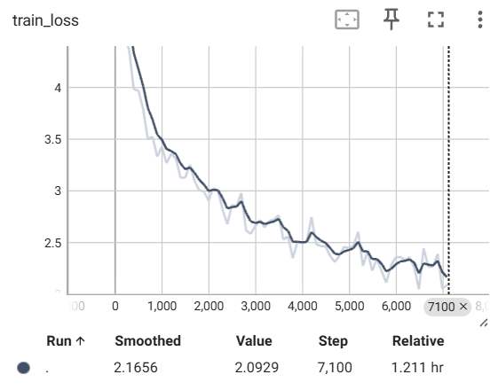

<!-- 
This README is generated partially by Ai
-->

<h1 align="center"> Deep Learning Practice and Transformer Implementation </h1>

 A Comprehensive PyTorch Project Repository for Neural Network Optimization and Attention Mechanism Mastery. 

  
  
  
  

<!-- 
  **Note:** These are static placeholder badges. Replace them with your project's actual badges.
  You can generate your own at https://shields.io
-->

## 📖 Table of Contents

- [⭐ Overview](#-overview)
- [🛠️ Key Implementation: Transformer (from-scratch)](#️-key-implementation-transformer-from-scratch)
- [📉 Experiments](#-experiments)
- [🚀 Research Roadmap](#-research-roadmap)

## ⭐ Overview

This repository serves as a meticulously organized, hands-on learning environment for mastering advanced deep learning concepts, neural network optimization, and the architecture of modern sequence models, specifically focusing on PyTorch implementations.

This repository collects my practical deep learning work, including:
- from-scratch reproduction and implementation of Multi-Layer Perceptron (MLP) models
- from-scratch implementation of core Transformer components in PyTorch
- experiments on image classification with PyTorch
- notes and notebooks on neural network optimization and machine learning strategy

## 🛠️ Key Implementation: Transformer (from scratch)

The core of this repository is a modular, from-scratch implementation of the Transformer architecture as described in "Attention Is All You Need". Instead of using `nn.Transformer`, I implemented the architecture from the ground up to master the underlying tensor operations and gradient dynamics.

### The Core Mechanism: Scaled Dot-Product Attention
The model computes attention scores using the formula:
$$\text{Attention}(Q, K, V) = \text{softmax}\left(\frac{QK^T}{\sqrt{d_k}}\right)V$$

### Module Breakdown:  
- [ScaledDotProductAttention.py](Attention_is_All_You_Need/ScaledDotProductAttention.py): 
  Implements scaled dot-product attention with optional masking.

- [MultiHeadAttention.py](Attention_is_All_You_Need/MultiHeadAttention.py): 
  Wraps multiple attention heads and concatenates their outputs.

- [PositionEncoding.py](Attention_is_All_You_Need/PositionEncoding.py): 
  Provides sinusoidal positional encodings for token embeddings.

- [EncoderLayer.py](Attention_is_All_You_Need/EncoderLayer.py): 
  One Transformer encoder block (self-attention + feed-forward + residual + normalization).

- [Encoder.py](Attention_is_All_You_Need/Encoder.py): 
  Stacks multiple encoder layers into the full encoder.

- [DecoderLayer.py](Attention_is_All_You_Need/DecoderLayer.py): 
  One Transformer decoder block (masked self-attention + cross-attention + feed-forward).

- [Decoder.py](Attention_is_All_You_Need/Decoder.py): 
  Stacks multiple decoder layers into the full decoder.

- [Transformer.py](Attention_is_All_You_Need/Transformer.py): 
  Full encoder–decoder Transformer architecture combining all components.

## 📉 Experiments

Model trained with $d_{model}=512$, $h=8$, $batch_size=64$ on a subset of WMT14:

✔️ dataset: WMT14-short de-en

✔️ task: machine translation

The training objective shows a monotonically decreasing trend, indicating that the implementation is functionally correct and optimization is effective. Training was limited to 7100 steps due to Google Colab session time constraints.

Transformer Training Loss(partial training):

## 🚀 Research Roadmap
[x] Complete from-scratch Transformer implementation.

[ ] Complete full training for multiple epochs when resources allow

[ ] Replace Layer Normalization with alternative normalization schemes (e.g., DeRF) to study stability and training dynamics.
